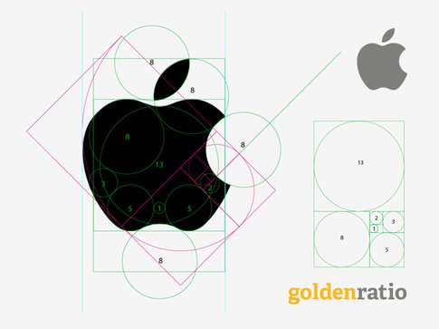
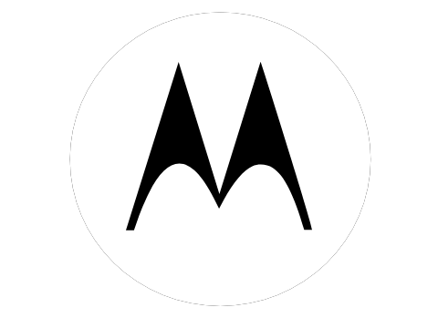

# GitChinaLab UI Think

### GitChinaLab 是什么
- 安全的代码托管平台 
- 自动化devops平台
- 主营私有化部署业务

### 初步想法

1. 黑白为主
2. Logo采用**吉祥物元素**在里边

### 参考

- GitHub 章鱼猫

- Apple

- Motorola

- ABC

- Reddit

- WordPress

- Twitter

- 其它

